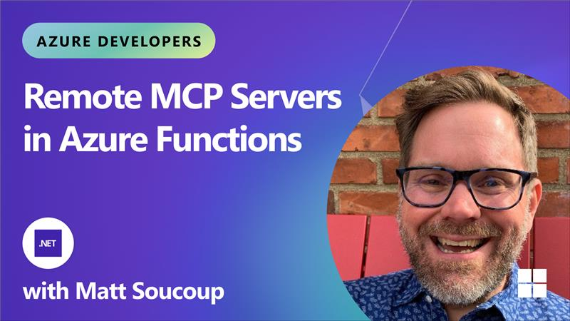
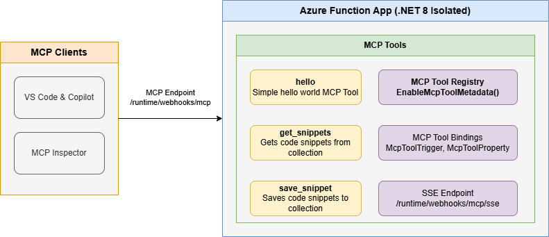

<!--
---
name: Remote MCP with Azure Functions (.NET/C#)
description: Run a remote MCP server on Azure functions.  
page_type: sample
languages:
- csharp
- bicep
- azdeveloper
products:
- azure-functions
- azure
urlFragment: remote-mcp-functions-dotnet
---
-->

# Getting Started with Remote MCP Servers using Azure Functions (.NET/C#)

This is a quickstart template to easily build and deploy a custom remote MCP server to the cloud using Azure functions. You can clone/restore/run on your local machine with debugging, and `azd up` to have it in the cloud in a couple minutes.

The MCP server is configured with [built-in authentication](https://learn.microsoft.com/en-us/azure/app-service/overview-authentication-authorization) using Microsoft Entra as the identity provider.

You can also use [API Management](https://learn.microsoft.com/azure/api-management/secure-mcp-servers) to secure the server, as well as network isolation using VNET.

[](https://www.youtube.com/watch?v=XwnEtZxaokg)

If you're looking for this sample in more languages check out the [Node.js/TypeScript](https://github.com/Azure-Samples/remote-mcp-functions-typescript) and [Python](https://github.com/Azure-Samples/remote-mcp-functions-python) samples.  

[](https://codespaces.new/Azure-Samples/remote-mcp-functions-dotnet)

## Prerequisites

### Required for all development approaches

+ [.NET 10 SDK](https://dotnet.microsoft.com/download/dotnet/10.0)
+ [Azure Functions Core Tools](https://learn.microsoft.com/azure/azure-functions/functions-run-local?pivots=programming-language-csharp#install-the-azure-functions-core-tools) >= `4.5.0`
+ [Azure Developer CLI](https://aka.ms/azd) **1.23.x or above** (for deployment)

### For Visual Studio development

+ [Visual Studio 2022](https://visualstudio.microsoft.com/vs/)
+ Make sure to select the **Azure development** workload during installation

### For Visual Studio Code development

+ [Visual Studio Code](https://code.visualstudio.com/)
+ [Azure Functions extension](https://marketplace.visualstudio.com/items?itemName=ms-azuretools.vscode-azurefunctions)

> **Choose one**: You can use either Visual Studio OR Visual Studio Code. Both provide full debugging support, but the setup steps differ slightly.

Below is the architecture diagram for the Remote MCP Server using Azure Functions:



## Prepare your local environment

An Azure Storage Emulator is needed for this particular sample because we will save and get snippets from blob storage. Start Azurite emulator:

```shell
docker run -d -p 10000:10000 -p 10001:10001 -p 10002:10002 \
    mcr.microsoft.com/azure-storage/azurite
```

>**Note** if you use Azurite coming from VS Code extension you need to run `Azurite: Start` now or you will see errors.

## Run and test locally

### MCP Functions Tool

#### Step 1: Start the Functions host

From the `src/FunctionsMcpTool` folder, run this command to start the Functions host locally:

```shell
cd src/FunctionsMcpTool
func start
```

> **Note:** The MCP Resources and Prompts projects run as separate Function Apps. To start them locally alongside the tools server, open additional terminals:
>
> ```shell
> cd src/FunctionsMcpResources
> func start --port 7072
> ```
>
> ```shell
> cd src/FunctionsMcpPrompts
> func start --port 7073
> ```

#### Step 2: Connect to the MCP server

You can connect to your local MCP server using VS Code with GitHub Copilot or MCP Inspector.

##### Option A: VS Code with GitHub Copilot

1. Open **.vscode/mcp.json**. Find the server called *local-mcp-function* and click **Start** above the name. The server is already set up with the running Function app's MCP endpoint:

    ```shell
    http://localhost:7071/runtime/webhooks/mcp
    ```

1. In Copilot chat **agent** mode enter a prompt to trigger the tool, e.g., select some code and enter this prompt

    ```plaintext
    Say Hello 
    ```

    ```plaintext
    Save this snippet as snippet1 
    ```

    ```plaintext
    Retrieve snippet1 and apply to NewFile.cs
    ```

1. When prompted to run the tool, consent by clicking **Continue**

1. When you're done, press Ctrl+C in the terminal window to stop the `func.exe` host process.

##### Option B: MCP Inspector

1. In a **new terminal window**, install and run MCP Inspector

    ```shell
    npx @modelcontextprotocol/inspector
    ```

1. CTRL click to load the MCP Inspector web app from the URL displayed by the app (e.g. `http://0.0.0.0:5173/#resources`)
1. Set the transport type to `Streamable HTTP`
1. Set the URL to your running Function app's MCP endpoint and **Connect**:

    ```shell
    http://0.0.0.0:7071/runtime/webhooks/mcp
    ```

1. **List Tools**. Click on a tool and **Run Tool**.

#### Verify local blob storage (optional)

After testing the snippet save functionality locally, you can verify that blobs are being stored correctly in your local Azurite storage emulator.

**Using Azure Storage Explorer:**

1. Open Azure Storage Explorer
1. In the left panel, expand **Emulator & Attached** → **Storage Accounts** → **(Emulator - Default Ports) (Key)**
1. Navigate to **Blob Containers** → **snippets**
1. You should see any saved snippets as blob files in this container
1. Double-click on any blob to view its contents and verify the snippet data was saved correctly

**Using Azure CLI (alternative):**

```shell
# List blobs in the snippets container
az storage blob list --container-name snippets --connection-string "DefaultEndpointsProtocol=http;AccountName=devstoreaccount1;AccountKey=Eby8vdM02xNOcqFlqUwJPLlmEtlCDXJ1OUzFT50uSRZ6IFsuFq2UVErCz4I6tq/K1SZFPTOtr/KBHBeksoGMGw==;BlobEndpoint=http://127.0.0.1:10000/devstoreaccount1;"
```

```shell
# Download a specific blob to view its contents
az storage blob download --container-name snippets --name <blob-name> --file <local-file-path> --connection-string "DefaultEndpointsProtocol=http;AccountName=devstoreaccount1;AccountKey=Eby8vdM02xNOcqFlqUwJPLlmEtlCDXJ1OUzFT50uSRZ6IFsuFq2UVErCz4I6tq/K1SZFPTOtr/KBHBeksoGMGw==;BlobEndpoint=http://127.0.0.1:10000/devstoreaccount1;"
```

### Weather MCP App

This repository also includes a Weather App sample that demonstrates MCP tools with an interactive UI. See [src/McpWeatherApp/README.md](src/McpWeatherApp/README.md) for details.

1. Build the UI:

    ```shell
    cd src/McpWeatherApp/app
    npm install
    npm run build
    cd ..
    ```

1. Run the function app:

    ```shell
    func start
    ```

1. In **.vscode/mcp.json**, click **Start** above *local-mcp-function*

1. Ask Copilot: "What's the weather in Seattle?"

### Fluent API MCP App (Dynamic Dashboard)

The FunctionsMcpApp sample shows how to render **dynamic data** with the fluent API. The dashboard UI is a Vite-bundled TypeScript app that receives tool results via `@modelcontextprotocol/ext-apps` and renders tiles, charts, and status indicators in real time. See [src/FunctionsMcpApp/README.md](src/FunctionsMcpApp/README.md) for details.

1. Build the dashboard UI:

    ```shell
    cd src/FunctionsMcpApp/app
    npm install
    npm run build
    cd ..
    ```

1. Run the function app:

    ```shell
    func start
    ```

1. In **.vscode/mcp.json**, click **Start** above *local-mcp-function*

1. Ask Copilot to open the Snippet Dashboard

## Deploy to Azure

Stop the local server with `Ctrl+C` and switch back to the root directory.

### Step 1: Sign in to Azure

```shell
az login
azd auth login
```

### Step 2: Create an environment and configure

```shell
azd env new <environment-name>
```

Configure VS Code as an allowed client application to request access tokens from Microsoft Entra:

```shell
azd env set PRE_AUTHORIZED_CLIENT_IDS aebc6443-996d-45c2-90f0-388ff96faa56
```

**Optional:** Enable VNet isolation:

```bash
azd env set VNET_ENABLED true
```

### Step 3: Deploy

1. Set `DEPLOY_SERVICE` to provision one of the MCP server projects: 
    ```shell
    azd env set DEPLOY_SERVICE <tools, resources, prompts, weather, or apps> 
    ```

1. Provision the resources for the app: 
    ```shell
    azd provision
    ```

    When prompted, pick your subscription, an Azure region for the resources, and choose `false` to skip creating virtual network resources to simplify the deployment.

1. Deploy the app of your choice:

    ```shell
    # Deploy only the MCP Tools (with Entra auth)
    azd deploy --service tools

    # Deploy only the MCP Resources
    azd deploy --service resources

    # Deploy only the MCP Prompts
    azd deploy --service prompts

    # Deploy only the Weather App (with access token)
    azd deploy --service weather

    # Deploy only the Fluent API App (dynamic dashboard)
    azd deploy --service apps
    ```

### Step 4: Connect to the remote MCP server

After deployment finishes, open **.vscode/mcp.json** and click **Start** above *remote-mcp-function*. You'll be prompted for `functionapp-name` (find it in your azd command output or `/.azure/*/.env` file). You'll also be prompted to authenticate with Microsoft—click **Allow** and login with your Azure subscription email.

>[!TIP]
>Successful connect shows the number of tools the server has. You can see more details on the interactions between VS Code and server by clicking on **More... -> Show Output** above the server name.

## Redeploy and clean up

**Redeploy all:** Run `azd up` as many times as needed to deploy code updates.

**Redeploy one service:** Use `azd deploy tools`, `azd deploy resources`, `azd deploy prompts`, `azd deploy weather`, or `azd deploy apps` to redeploy a specific app.

**Clean up:** Delete all Azure resources when done:

```shell
azd down
```

## Source Code

The solution is organized into separate Azure Function projects by MCP capability:

| Project | Path | Description |
|---------|------|-------------|
| **FunctionsMcpTool** | `src/FunctionsMcpTool/` | MCP Tools — snippet CRUD, QR code generation, badges, website preview |
| **FunctionsMcpResources** | `src/FunctionsMcpResources/` | MCP Resources — snippet resource template, server info resource |
| **FunctionsMcpPrompts** | `src/FunctionsMcpPrompts/` | MCP Prompts — code review checklist, summarize content, generate docs |
| **FunctionsMcpApp** | `src/FunctionsMcpApp/` | MCP Apps (Fluent API) — dynamic dashboard with Vite UI, static hello app |
| **McpWeatherApp** | `src/McpWeatherApp/` | Weather App — standalone MCP demo with interactive UI |

The function code for the `GetSnippet` and `SaveSnippet` endpoints are defined in [`SnippetsTool.cs`](./src/FunctionsMcpTool/SnippetsTool.cs). The `McpToolsTrigger` attribute applied to the async `Run` method exposes the code function as an MCP Server.

The following shows the code for a few MCP server examples (get string, get object, save object):

```csharp
[Function(nameof(GetSnippet))]
public object GetSnippet(
    [McpToolTrigger(GetSnippetToolName, GetSnippetToolDescription)] ToolInvocationContext context,
    [BlobInput(BlobPath)] string snippetContent)
{
    return snippetContent;
}

[Function(nameof(SaveSnippet))]
[BlobOutput(BlobPath)]
public string SaveSnippet(
    [McpToolTrigger(SaveSnippetToolName, SaveSnippetToolDescription)] ToolInvocationContext context,
    [McpToolProperty(SnippetNamePropertyName, PropertyType, SnippetNamePropertyDescription)] string name,
    [McpToolProperty(SnippetPropertyName, PropertyType, SnippetPropertyDescription)] string snippet)
{
    return snippet;
}

[Function(nameof(SayHello))]
public string SayHello(
    [McpToolTrigger(HelloToolName, HelloToolDescription)] ToolInvocationContext context
)
{
    logger.LogInformation("C# MCP tool trigger function processed a request.");
    return "Hello I am MCP Tool!";
}
```

## Next Steps

+ Add [API Management](https://github.com/Azure-Samples/remote-mcp-apim-functions-python) to your MCP server
+ Enable VNET using VNET_ENABLED=true flag
+ Learn more about [related MCP efforts from Microsoft](https://github.com/microsoft/mcp/tree/main/Resources)

## Troubleshooting

| Problem | Solution |
|---------|----------|
| Connection refused | Ensure Azurite is running (`docker run -p 10000:10000 -p 10001:10001 -p 10002:10002 mcr.microsoft.com/azure-storage/azurite`) |
| API version not supported by Azurite | Pull the latest Azurite image (`docker pull mcr.microsoft.com/azure-storage/azurite`) then restart Azurite and the app |
