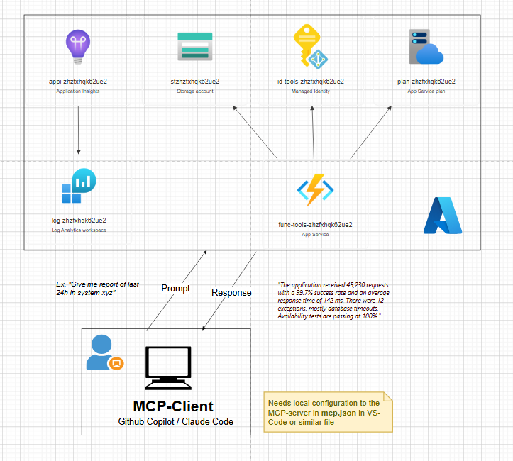

# AI-Powered IT Operational Insights for Azure — Just Ask in Plain Language

[](https://www.linkedin.com/in/erik-k-ipsen/)

This project gives companies a fully customizable AI assistant — powered by Claude or GitHub Copilot — that connects directly to Azure. Ask questions in plain language, get real answers from real data. No expertise needed. Built on a controlled, secure foundation that the company owns and manages.


<sub>Example: a plain-language prompt returning a system summary for the last 24h. The customized tool (highlighted in red) is just one example — this project lets you build your own IT operational insights tools tailored to your needs.</sub>

---

## Content list

- [What Problem Does This Solve?](#what-problem-does-this-solve)
- [Who Is This For?](#who-is-this-for)
- [Security: Data Stays in Company Control](#security-data-stays-in-company-control)
- [Tools Already in Place](#tools-already-in-place)
- [Ideas for Customized Azure Tools](#ideas-for-customized-azure-tools)
- [Project Structure — Five Independent MCP Servers](#project-structure--five-independent-mcp-servers)
- [Architecture Diagrams](#architecture-diagrams)
- [Extending Microsoft's Official MCP Template](#extending-microsofts-official-mcp-template)

---

## What Problem Does This Solve?

Getting answers out of Azure tools takes time and expertise. Alternatives like the Azure CLI or general-purpose AI agents can help — but they require technical knowledge.

This project takes a different approach: customized tools built for the company's own Azure environment, secured with company identity, and simple enough for any employee to use. Instead of navigating dashboards or writing queries, just ask:

> *"How is our production app performing right now?"*
> *"Were there any errors in the payment service in the last 24 hours?"*

The AI answers with real data, using the permissions of the person who asked — no technical expertise required.

---

## Who Is This For?

This template is a great fit for:

- **Software companies and consulting firms** on Azure — keeping developers and teams in flow by letting AI extract operational insights and troubleshoot incidents, without leaving the code editor or switching between client environments
- **Manufacturing and enterprise companies** that use Azure for internal systems and want team leads or operations staff to access data without needing Azure expertise

---

## Security: Data Stays in Company Control

Completely **self-hosted** inside the company's own Azure subscription, secured with Microsoft Entra ID — the same system behind Microsoft 365 and Teams.

- ✅ **Only company employees can use it** — login required, no anonymous access.
- ✅ **Each person sees only what they're allowed to see** — the AI acts on behalf of the logged-in user, using their own Azure permissions.
- ✅ **Data never leaves Azure** — no external services involved.
- ✅ **No passwords stored** — short-lived security tokens only.

The AI carries the same keycard as the person using it. It can only open the doors they're allowed to open.

---

## Tools Already in Place

### ⭐ Application Insights Event Report (`azure_events_reports`)

The standout tool. Every Azure application generates a continuous stream of monitoring data — requests, response times, errors, exceptions. Reading this data normally requires Azure Portal access and knowledge of KQL query syntax.

With this tool, anyone can simply ask:

> *"Give me a report on the payment service for the last 24 hours."*

And get back a plain-language summary covering:

| What it measures | What it tells you |
|---|---|
| Request volume and success rate | Is the app healthy? How many users are hitting it? |
| Response times (avg, P95) | Is the app fast? Are there slowdowns under load? |
| Errors and exceptions | What is breaking, and how often? |
| External dependencies | Is the database or a third-party API the bottleneck? |
| Trend comparison | Is the situation improving or getting worse vs. the previous period? |

Supports both English and Danish responses — just ask in the language you prefer.

### Other Tools

- **`get_snippet` / `save_snippet` / `batch_save_snippets`** — Store and retrieve code snippets from Azure Blob Storage. Useful as a shared snippet library accessible directly from the AI assistant.
- **`GetWeather`** — Returns current weather for any location via the Open-Meteo API. A lightweight example of connecting an external API as an MCP tool.
- **`hello_tool_with_auth`** — Demo tool that verifies the On-Behalf-Of authentication flow works end to end. Useful as a starting point when building new tools that require user identity.

---

## Ideas for Customized Azure Tools

The tools above are just the beginning. A development team can build new tools that connect to any Azure service or internal system. Here are some ideas focused on IT operations:

### Cost Monitoring
> *"What did we spend on Azure last month, broken down by team?"*

Connect to Azure Cost Management and let team leads check cloud spending in plain language — no Excel exports, no waiting for the monthly report.

### Active Alerts Summary
> *"Are there any open alerts in our production environment right now?"*

Pull all active Azure Monitor alerts and present them as a readable summary. Ideal for morning stand-ups or on-call handovers.

### Incident Investigation Assistant
> *"There is a spike in errors in the checkout service. What changed in the last two hours?"*

During an incident, automatically gather relevant context: recent deployments, error spikes, slow external dependencies, and unusual traffic patterns — all in one answer, in seconds.

### Security Posture Summary
> *"Do we have any critical security recommendations from Microsoft Defender?"*

Pull from Microsoft Defender for Cloud and summarize open security findings by severity. Give security-conscious managers a weekly health check without requiring them to log into another portal.

### Database Performance Insights
> *"Is our Azure SQL database performing well this week?"*

Surface query performance, CPU usage, slow queries, and connection counts from Azure SQL or Cosmos DB in plain language — useful for both developers and operations teams.

### Capacity Planning
> *"Which of our services is getting close to its limits?"*

Aggregate CPU, memory, and request metrics across all services and flag anything approaching its configured maximum — before it becomes a problem.

---

## Project Structure — Five Independent MCP Servers


This solution contains five Azure Functions projects, each deployable as its own MCP server. They can be enabled individually in `.vscode/mcp.json` by adding the corresponding endpoint.

### ⭐ `FunctionsMcpTool` — Main project, start here

This is where all operational tools are implemented, including the `azure_events_reports` tool. It is the primary project to extend when building new customized IT tools for your Azure environment. Secured with Microsoft Entra ID using the On-Behalf-Of flow so every tool call runs under the identity of the person asking.

### `FunctionsMcpApp`

Demonstrates MCP Apps — tools that return interactive UI components (HTML views) rather than plain text. Useful for building richer experiences like dashboards or visual summaries inside the AI assistant.

### `FunctionsMcpPrompts`

Contains reusable MCP Prompts — pre-built prompt templates (e.g. code review checklists, summarization, documentation generation) that can be invoked by name from the AI assistant.

### `FunctionsMcpResources`

Exposes MCP Resources — data sources the AI can read, such as code snippets stored in Azure Blob Storage or server metadata. Resources complement tools by providing context rather than performing actions.

### `McpWeatherApp`

A standalone weather tool that calls the Open-Meteo API. A clean, minimal example of how to connect an external API as an MCP tool, useful as a reference when building new integrations.

### Choosing which projects to deploy

Set `DEPLOY_SERVICE` in your azd environment before running `azd provision`:

```powershell
azd env set DEPLOY_SERVICE tools   # deploy only FunctionsMcpTool
azd env set DEPLOY_SERVICE all     # deploy all five projects
```

Allowed values: `tools`, `weather`, `resources`, `prompts`, `apps`, `all`. The setting is stored in `.azure/<env-name>/.env` and read by [`infra/main.parameters.json`](infra/main.parameters.json).

---

## Architecture Diagram



<sub>Cloud system architecture for `FunctionsMcpTool`. An MCP client (e.g. GitHub Copilot) sends a plain-language prompt to the MCP server hosted on Azure Functions. The server processes the request, queries Azure services, and returns the answer in natural language back to the client.</sub>

---

## Extending Microsoft's Official Azure MCP-Server Template

Built on top of Microsoft's [remote-mcp-functions-dotnet](https://github.com/Azure-Samples/remote-mcp-functions-dotnet), adding Entra ID On-Behalf-Of authentication, Application Insights querying across Azure subscriptions, and an extensible helper architecture for building new tools.
